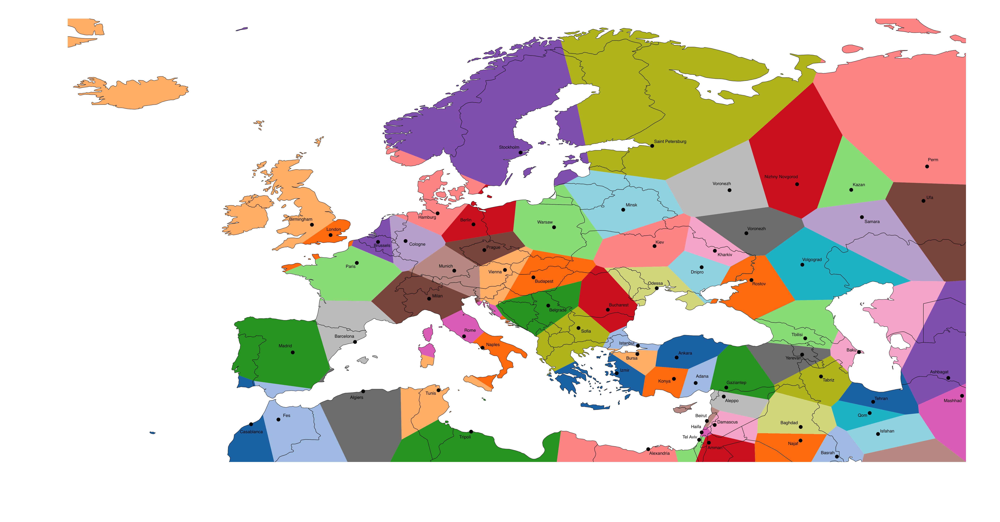

# voronoi-europe
<html>
  <head>
    What if European countries were determined by how close they were to another capital?
    
  </head>
  
  <body>
    

      Well wonder no more! Created using geopandas, with shapely as the main library for processing geometric shapes. Used scipy's voronoi functionality to determine the boundaries
  

  
    

      Also incuded for a slightly larger region, and instead of capitals, cities with one million or more people
  

  
  </body>
  

</html>
